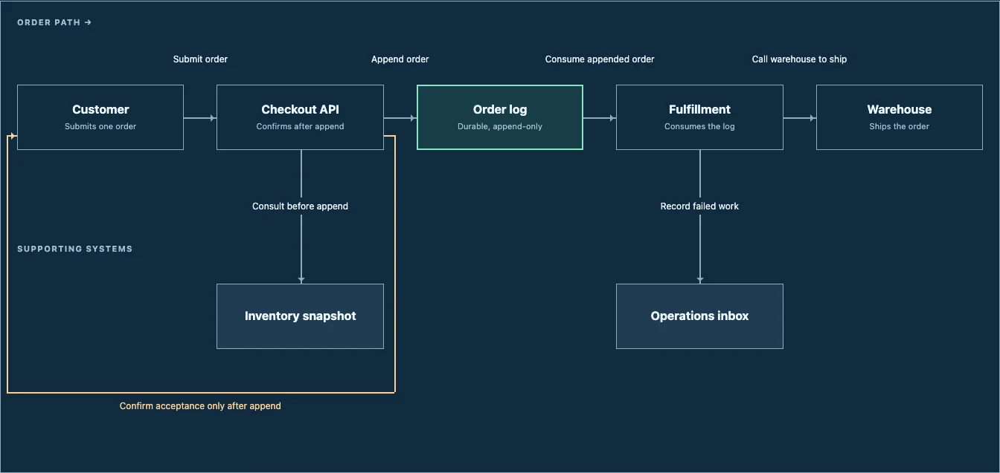

# Diagrams should be files you own

Our vision is to make clear, useful diagrams a normal output of working with an agent. Describe a system, review the explanation, and keep the result as portable HTML. You should not need another paid diagramming application just to explain how something works.

**Available today:** a free, MIT-licensed [workflow diagram skill](https://github.com/arunai30/super-document-skills/tree/main/skills/create-workflow-diagram) that helps an agent write self-contained HTML and CSS. **What we want to build next:** a small, open-source JavaScript and CSS authoring library that turns a meaningful diagram specification into readable HTML. The proposed library and API below are not released.

## The problem is understanding, not drawing boxes

Agents can explain a system at extraordinary length. That does not mean a human can follow it. A useful architecture diagram answers a question: When is this request accepted? What happens if the worker fails? Which boundary does this data cross?

Asking an agent to draw every box and route every connector from scratch adds another problem. Labels collide, arrows obscure the main path, and small changes require repeated visual corrections. A diagram can look polished and still fail to explain the system.

We want a repeatable way to turn understanding into a readable explanation. The agent chooses the story and checks it against the source. A shared recipe handles the geometry. The reader sees the important path first, with supporting detail where it helps.

## Why HTML

The browser already gives us text, typography, layout, links, accessibility primitives, and print. A diagram can sit beside its explanation, assumptions, and source references in one document. Its text remains selectable. Its styles and content can be changed with ordinary tools. The exported file can be kept locally, versioned in Git, or hosted wherever the owner chooses.

HTML does not automatically produce good information design. That is what the skill and library must contribute: explicit hierarchy, useful spacing, labeled relationships, and a limit on how much one view tries to explain.

This is not an argument that every existing diagram tool charges money. [draw.io is free and open source](https://www.drawio.com/). Our direction is an agent-first authoring workflow with portable output, not a claim that we invented free diagramming or have replaced every editor feature.

## What we have already tried

These are proposed architecture exercises, not verified diagrams of the named companies' production systems. Open the artifacts for their sources and scope.

| Example | What it helps the reader understand | What it tested |
| --- | --- | --- |
| [Ride dispatch](https://shareartifacts.dev/view/p_lOYJZbg95LdNmnnE72FwYQ) | The path from a ride request to a driver offer | A focused system-design explanation with computed connector geometry |
| [URL shortener · editorial](https://shareartifacts.dev/view/p_D1z2AGjAVh0MrBLt5f1P9Q) / [blueprint](https://shareartifacts.dev/view/p_vFSOO7p_EadCQXT1S7rhvA) | A short link becomes a lookup and a redirect | The same model presented in two visual styles |
| [Webhook receiver · blueprint](https://shareartifacts.dev/view/p_DhBV6kPVkUuhYsSyT1laDA) / [editorial](https://shareartifacts.dev/view/p_iI9Iw0vCe9panfgT196lEg) | Durable acceptance is separate from processing; failed work takes a retry path | Main flow, support systems, and feedback paths in one readable view |

Those examples used an earlier local JavaScript renderer. They demonstrate the visual direction; they are not evidence of runtime-free authoring.

We then removed the runtime requirement from the customer creation workflow. The current skill packages an HTML/CSS template and a constrained diagram grammar. In a separate test, Claude Code received the installed skill and one checkout-system prompt, read the skill resources, and wrote the HTML using only file tools. No Node process, diagram package, or browser correction loop was used to create that output. We inspected it afterward. That is a successful trial, not a guarantee for every prompt.

The current recipe handles a focused main path, supporting nodes, and a small number of feedback routes. Large dependency graphs, arbitrary topology, and exact concurrency belong in other views. The [experiment write-up](https://shareartifacts.dev/view/p_nKulpbRmNy4DcXHK5XaEJw) records the earlier renderer work.



*Diagram-only screenshot of the one-prompt checkout output. The original was HTML and CSS; this image is a preview, not the editable artifact.*

## The library we want to build

Separate three responsibilities:

1. **Meaning, authored by the agent.** The question, audience, nodes, relationships, boundaries, sources, and uncertainties. Stable identifiers describe things in the system; they are not pixel positions.
2. **Layout, owned by the recipe.** Spacing, label placement, connector routes, visual hierarchy, and theme. Start with a few well-tested diagram families rather than promise arbitrary graphs immediately.
3. **Output, owned by the customer.** A self-contained HTML/CSS document with readable text and an accessible explanation. It must remain useful without loading our service or executing the authoring library.

An illustrative specification, **not an accepted API today**:

```json
{
  "version": "proposed-1",
  "question": "When is an order accepted?",
  "layout": "workflow",
  "theme": "blueprint",
  "nodes": [
    { "id": "customer", "label": "Customer", "kind": "actor" },
    { "id": "api", "label": "Checkout API", "kind": "service" },
    { "id": "log", "label": "Order log", "kind": "store" }
  ],
  "edges": [
    { "from": "customer", "to": "api", "label": "Submit order" },
    { "from": "api", "to": "log", "label": "Append durably" },
    {
      "from": "api", "to": "customer", "kind": "feedback",
      "label": "Confirm only after append"
    }
  ]
}
```

The first version should validate the supported shape before rendering, reject missing references, and explain when a diagram needs to be split. Layout should reserve room for labels and route connectors consistently. With the same specification, theme, and library version, geometry should be reproducible; the agent's interpretation of a prompt is a separate source of variation.

Themes should change appearance without changing meaning. Stable IDs should let us preserve unaffected parts of the layout when a system changes. Both are design goals to test, not claims about a finished engine.

## The customer experience is the constraint

**Install the skill → give one prompt → review a useful diagram.**

The current static template works with file-writing agents without a separate rendering runtime. A future JS library must preserve that easy path. It could be bundled into a skill's supported authoring environment, or run in a local browser with a static export. If it requires the customer to assemble a Node toolchain just to get the first result, we have not solved onboarding. Keep the HTML/CSS fallback until the improved path is proven.

share/artifacts remains a publishing service. Generation happens in the customer's chosen agent or environment. The library is an authoring dependency; published output does not need to execute it. This vision does not enable arbitrary JavaScript in uploaded artifacts or move generation onto our servers.

The skill is free today. We intend the authoring library to be free and open source as well. Customer agent/model costs and optional share/artifacts hosting plans are separate. Local use and export must not require a hosting subscription.

## Build outward from clear explanations

Start with the workflow family we have exercised. Then add other diagram families only when they solve a distinct reader problem: system boundaries, runtime sequences, state changes, or a before/after architecture decision. Each needs its own layout rules and evidence, not another theme on the same arrangement.

Later, connect specifications to repository sources and propose diagram updates when relevant code changes. Preserve the reader's mental model, show the change, and keep publication under the owner's control. That is the direction behind our future Eraserbot alternative; repository monitoring and automatic diagram updates are not available today.

## What success should mean

- A reader can identify the main path, the important boundary, and the failure behavior without reading an essay first.
- Fresh agents can create useful diagrams from the same recipe, with few visual correction passes.
- Tests catch clipped labels, broken references, overlapping routes, and unsupported shapes before export.
- A change to one relationship does not needlessly rearrange the whole explanation.
- The exported document remains readable, accessible, and usable outside our service.

We should publish the prompts, specifications, outputs, corrections, and failure cases as we learn. The standard is human understanding. A beautiful diagram that communicates the wrong thing has failed.
