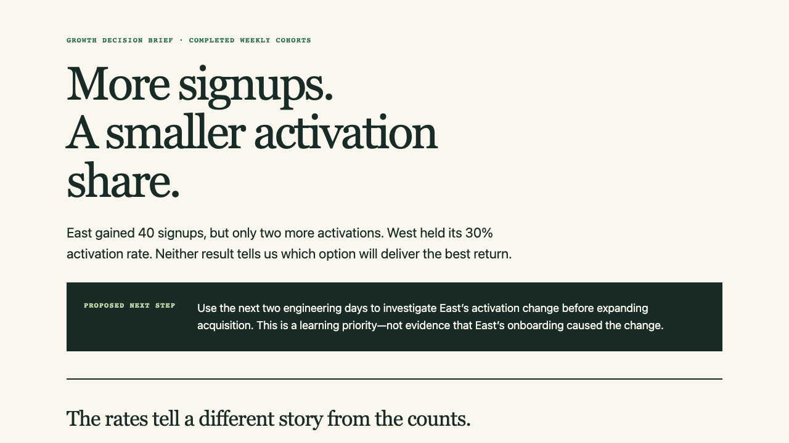
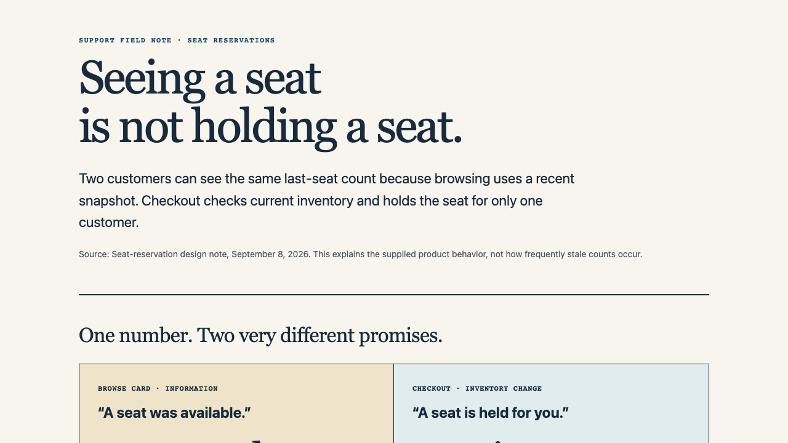
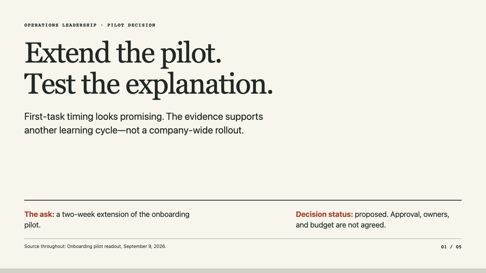

# See what your notes can become

Three transformations from fictional source material to useful documents.
Each screenshot is an actual example output; click it for a larger image.
The full HTML files are included for downloading and opening in a browser.
GitHub shows HTML source rather than rendering it.

**New here? [Try the complete copy-paste example](try-it.md).**

## Turn results into a decision

**Input:** four cohort rows, two engineering days, and a stakeholder claim that
onboarding doubled conversion. The source does not establish that claim.

**Request:** “Create a concise, visually distinctive HTML decision brief for our
growth team.” [Read the exact request and all source notes](source-inputs.md#request-1--report).

**Result:** a growth brief that compares counts and rates, keeps missing evidence
visible, and recommends a bounded next step. Useful when a team needs to decide
what to investigate before committing more resources.

[Full HTML source](growth-decision-brief.html) · [Get the report skill](../skills/create-visual-report/SKILL.md)

## Make a complex idea click

**Input:** six rules about browsing inventory, reserving a seat, and payment.

**Request:** “Why can two customers both see the last seat, but only one can buy
it?” [Read the exact request and all source notes](source-inputs.md#request-2--explainer).

**Result:** a visual sequence that separates a cached browsing estimate from an
actual checkout hold. Useful when support needs a clear explanation of behavior
that looks contradictory to a customer.

[Full HTML source](seat-count-explainer.html) · [Try this scenario](try-it.md) · [Get the explainer skill](../skills/create-visual-explainer/SKILL.md)

## Build a story for a decision

**Input:** a 24-person pilot, a historical comparison, incomplete manager feedback,
and unresolved approval and ownership.

**Request:** “Build a five-slide, read-alone HTML presentation for an operations
leadership review.” [Read the exact request and all source notes](source-inputs.md#request-3--presentation).

**Result:** a five-slide argument for a two-week pilot extension, with the limits
of the evidence kept visible. Useful when a review needs a specific next step
rather than a collection of results.

[Full HTML source](onboarding-pilot-deck.html) · [Get the presentation skill](../skills/create-html-presentation/SKILL.md)

## Help a client choose

The fictional Cedar Studio example compares two enquiry workflows, with matching
costs, exclusions, and a conditional recommendation.

[Open the live example](https://shareartifacts.dev/examples/client-decision-brief) · [Read the input and walkthrough](client-decision-brief/README.md)

## About these examples

These are possible outputs, not customer results, fixed templates, or guaranteed
outcomes. The original report and explainer were inspected at desktop and
390/320px widths; the deck was also checked slide by slide and in print.
[Validation and compatibility details](../docs/usage-and-validation.md#validation).

The three PNGs are opening-viewport captures (1280 × 720) of the included original
HTML examples, first prepared for the share/artifacts skills page from library
revision [0c82a43](https://github.com/arunai30/super-document-skills/commit/0c82a43c7fc2755694b5fcb200592e6b6c57b8e8). They show only the start of each
document. The examples and previews are covered by the repository's [MIT license](../LICENSE).

[Install a skill](../README.md#install) · [Try the complete sample](try-it.md)
