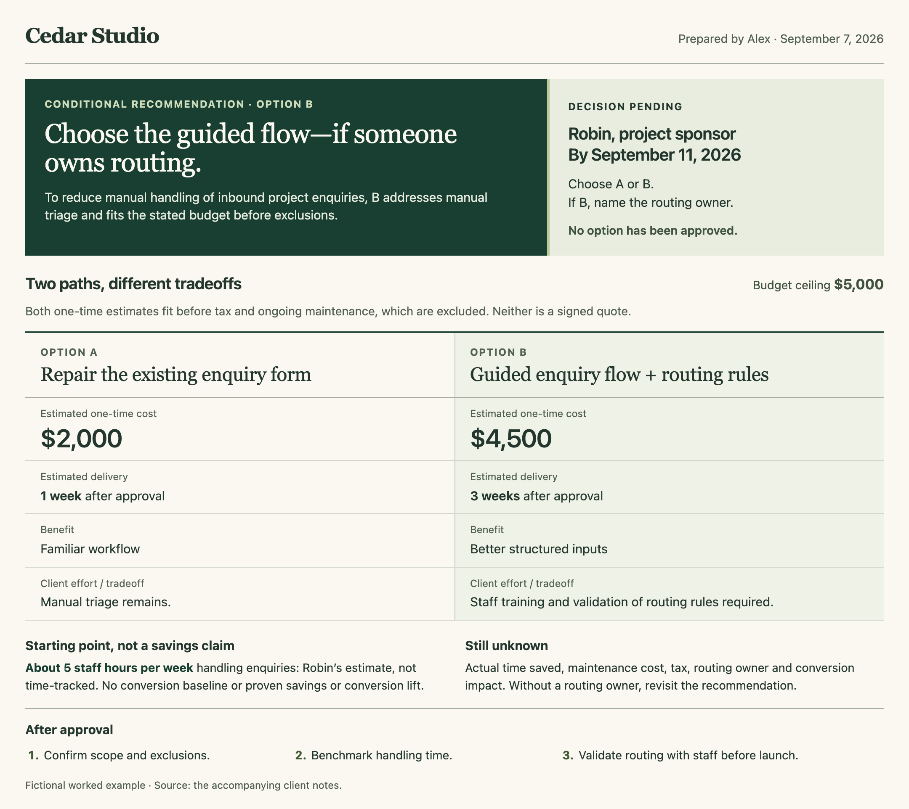
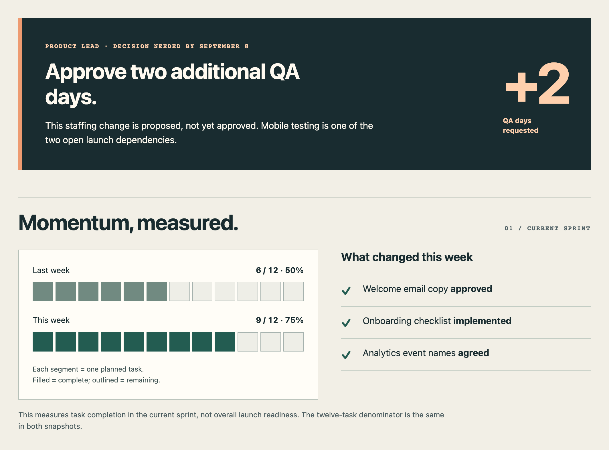

# See what your notes can become

Six examples of fictional source material turned into useful documents.
Screenshots show actual rendered examples; click an image to enlarge it.
The report, explainer, presentation, and client brief include full HTML files to
download and open in a browser. The newer weekly example links to its live page;
the blueprint is an image reference. GitHub shows HTML source rather than rendering it.

**New here? [Try the complete copy-paste example](try-it.md).**

## Turn results into a decision

**Input:** four cohort rows, two engineering days, and a stakeholder claim that
onboarding doubled conversion. The source does not establish that claim.

**Request:** “Create a concise, visually distinctive HTML decision brief for our
growth team.” [Read the exact request and all source notes](source-inputs.md#request-1--report).

**Result:** a growth brief that compares counts and rates, keeps missing evidence
visible, and recommends a bounded next step. Useful when a team needs to decide
what to investigate before committing more resources.

[Full HTML source](growth-decision-brief.html) · [Get the report skill](../skills/create-visual-report/SKILL.md)

## Make a complex idea click

**Input:** six rules about browsing inventory, reserving a seat, and payment.

**Request:** “Why can two customers both see the last seat, but only one can buy
it?” [Read the exact request and all source notes](source-inputs.md#request-2--explainer).

**Result:** a visual sequence that separates a cached browsing estimate from an
actual checkout hold. Useful when support needs a clear explanation of behavior
that looks contradictory to a customer.

[Full HTML source](seat-count-explainer.html) · [Try this scenario](try-it.md) · [Get the explainer skill](../skills/create-visual-explainer/SKILL.md)

## Build a story for a decision

**Input:** a 24-person pilot, a historical comparison, incomplete manager feedback,
and unresolved approval and ownership.

**Request:** “Build a five-slide, read-alone HTML presentation for an operations
leadership review.” [Read the exact request and all source notes](source-inputs.md#request-3--presentation).

**Result:** a five-slide argument for a two-week pilot extension, with the limits
of the evidence kept visible. Useful when a review needs a specific next step
rather than a collection of results.

[Full HTML source](onboarding-pilot-deck.html) · [Get the presentation skill](../skills/create-html-presentation/SKILL.md)

## Help a client choose

The fictional Cedar Studio example compares two enquiry workflows, with matching
costs, exclusions, and a conditional recommendation. The complete page shows how
editorial hierarchy brings the recommendation, comparison, and requested decision together.

[Open the live example](https://shareartifacts.dev/examples/client-decision-brief) · [Read the input and walkthrough](client-decision-brief/README.md)

## Make project progress visible

The newer Northstar weekly update is a first-party worked example from
share/artifacts. This section pairs a concrete decision request with a visual
comparison of completed sprint tasks. It keeps task progress separate from
launch readiness.

[Live example and source notes](https://shareartifacts.dev/examples/weekly-status-report) · [Project-management skill](../skills/create-project-management-artifact/SKILL.md)

This is a curated design example, not an output from the library's original
independent skill test. The [bundled weekly example](../skills/create-project-management-artifact/assets/weekly-update-example.html)
uses a different fictional project.

## Show how a system works

A blueprint-style order flow shows the main path, two supporting systems, and
when the customer receives confirmation. The labeled arrows carry meaning;
the color is a visual direction you can change.

[Diagram vision and scope](../docs/diagram-vision.md) · [Workflow-diagram skill](../skills/create-workflow-diagram/SKILL.md)

## About these examples

These are possible outputs, not customer results, fixed templates, or guaranteed
outcomes. Screenshots are selected sections except for the full client brief and
complete presentation slide. Text remains available in the linked HTML or source
notes; enlarge a screenshot to inspect small labels.

The original report and explainer were inspected at desktop and 390/320px widths;
the deck was also checked slide by slide and in print.
[Validation and compatibility details](../docs/usage-and-validation.md#validation).

Five PNGs were captured in Chromium at 2× resolution on September 21, 2026.
[Capture details and source provenance](previews/README.md). The existing blueprint
WebP is reused unchanged. The examples and previews are covered by the
repository's [MIT license](../LICENSE).

[Install a skill](../README.md#install) · [Try the complete sample](try-it.md)
